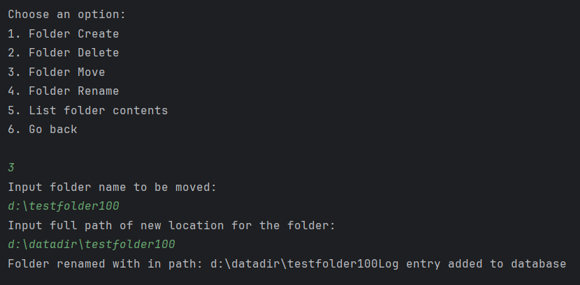

## File Utility system

This is a console based file and directory utility project which creates,
rename, delete, move files as well as folders. Additionaly
User can list folder contents and read .txt files as well as
get info regarding a file.

To Ensure program runs safely all the write function (create, move, delete etc.) have path validators
to make sure there is no modification in the application files it self
that also include root directory where program resides. so choose a different directory for creating, deleting and renaming of files.

You can still use "file get info", "file read" and "folder list content" methods in the program directory.

Below are few screenshots to familiarize you with the system.

### Start of program:

Above image shows the main menu of the screen having 4 options.

option 3 is selected to view logs but rightnow there exist
no entry as mentioned in the picture lets do some activity to
create log entries.

File handling has been selected from above menu. Select option 
1 to create file

Program prompts for a file name, after successfull creation of
file a log entry is added in database. Lets go back and select
folder menu

Above message describes that we cannot create folder in the program directory
(Path validators in action!!!)

As shown in the picture to create folder option 1 is selected
again and "testfolder100" is created and entry is added.

Option 3 is selected to show how we can move newly created folder
to a different location.
>warning **please mention full path with folder name
for the destination location**

Going back to "Check activity logs" section give us the logs of our
recent activity.

There are other methods as well which are implemented.

### Testing:

- Testing has implemented for All 3 logical classes. where the business
logic resides.
**Tracker.java** ,
**FileHandling.java** ,
and **FolderHandling.java**

- All public methods among these classes are been tested.
- UI methods in the main class are not tested as they are not part of the business logic.

